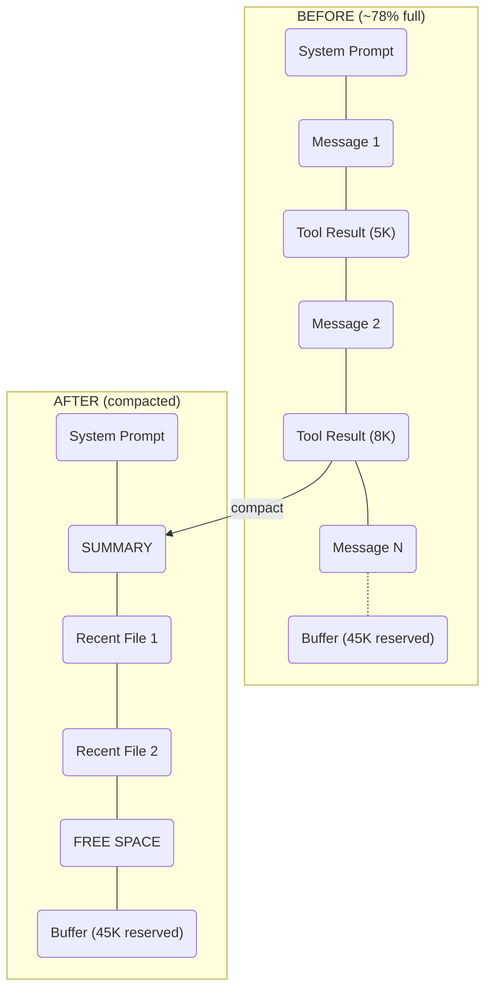

# excalidraw-to-mermaid

Convert [Excalidraw](https://excalidraw.com/) diagrams to [Mermaid](https://mermaid.js.org/) flowchart syntax.

No browser required. Works in Node.js and Bun.

## Before & After

### Context Window Compaction

**Excalidraw input:**


**Mermaid output:**



Frames become subgraphs. Arrow labels, edge styles (solid, dashed), and node connections are all preserved.

### Decision Flowchart

**Excalidraw input:**


**Mermaid output:**


### Shape Mapping

**Excalidraw input:**


**Mermaid output:**


Every Excalidraw shape maps to its Mermaid equivalent. Arrow styles are preserved too — solid, dashed, and thick.

### Real-World Architecture

**Excalidraw input:**


**Mermaid output:**


Multi-tier architecture with labeled edges, dashed connections for caching/storage, and container frames automatically filtered out.

---

## Install

```bash
npm install -g excalidraw-to-mermaid
```

Or use directly with npx:

```bash
npx excalidraw-to-mermaid diagram.excalidraw
```

## CLI Usage

```bash
# Print Mermaid to stdout
excalidraw-to-mermaid diagram.excalidraw

# Write to file
excalidraw-to-mermaid diagram.excalidraw -o output.md

# Force direction (TD, LR, BT, RL)
excalidraw-to-mermaid diagram.excalidraw --direction LR

# JSON output with metadata
excalidraw-to-mermaid diagram.excalidraw --json
```

### Options

| Flag | Description |
|------|-------------|
| `-o, --output <file>` | Write output to file |
| `-d, --direction <dir>` | Force direction: TD, LR, BT, RL |
| `--json` | Output as JSON with metadata |
| `-v, --version` | Show version |
| `-h, --help` | Show help |

## API Usage

```js
import { convert, convertFile } from "excalidraw-to-mermaid";

// From file
const result = convertFile("diagram.excalidraw");
console.log(result.mermaid);

// From parsed JSON
const doc = JSON.parse(fs.readFileSync("diagram.excalidraw", "utf-8"));
const result = convert(doc, { direction: "LR" });
console.log(result.mermaid);
// → graph LR
//       A[Start]
//       B[Process]
//       C[End]
//       A --> B
//       B --> C
```

### Return value

```js
{
  mermaid: "graph LR\n    A[Start]\n    ...",
  nodeCount: 3,
  edgeCount: 2,
  direction: "LR"
}
```

## What Gets Converted

### Node shapes

| Excalidraw | Mermaid | Syntax |
|-----------|---------|--------|
| Rectangle | Square box | `A[Label]` |
| Rounded rectangle | Rounded box | `A(Label)` |
| Diamond | Rhombus | `A{Label}` |
| Ellipse | Circle | `A((Label))` |
| Dashed rectangle | Subroutine | `A[[Label]]` |

### Edge styles

| Excalidraw | Mermaid | Syntax |
|-----------|---------|--------|
| Solid arrow | Arrow | `-->` |
| Solid line (no head) | Line | `---` |
| Dashed arrow | Dotted arrow | `-.->` |
| Dashed line | Dotted line | `-.-` |
| Thick arrow | Bold arrow | `==>` |
| Thick line | Bold line | `===` |

### Other features

- **Arrow labels** — Bound text on arrows becomes edge labels (`-->|label|`)
- **Subgraphs** — Excalidraw frames and grouped elements become Mermaid subgraphs
- **Auto direction** — Detects whether layout flows left-to-right or top-to-bottom
- **Special characters** — Labels with colons, brackets, pipes, etc. are automatically quoted

## Development

```bash
# Run tests (88 tests)
bun test

# Run a single test file
bun test test/parser.test.js
```

## Motivation

Inspired by [excalidraw/mermaid-to-excalidraw#66](https://github.com/excalidraw/mermaid-to-excalidraw/issues/66) — 100+ upvotes requesting the reverse direction (Excalidraw → Mermaid). This fills that gap.

## License

MIT
